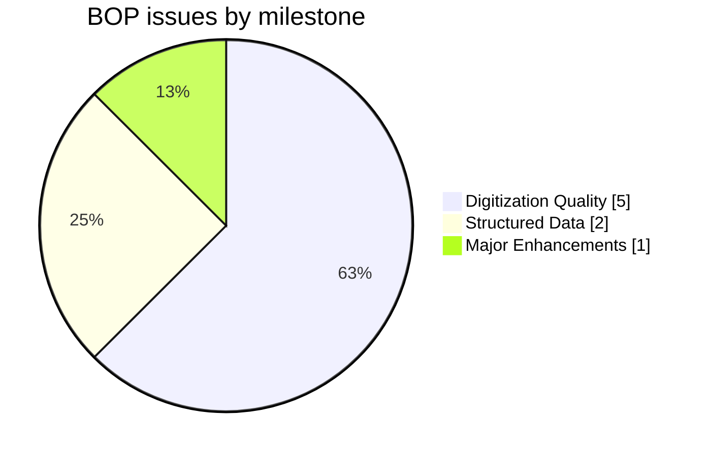
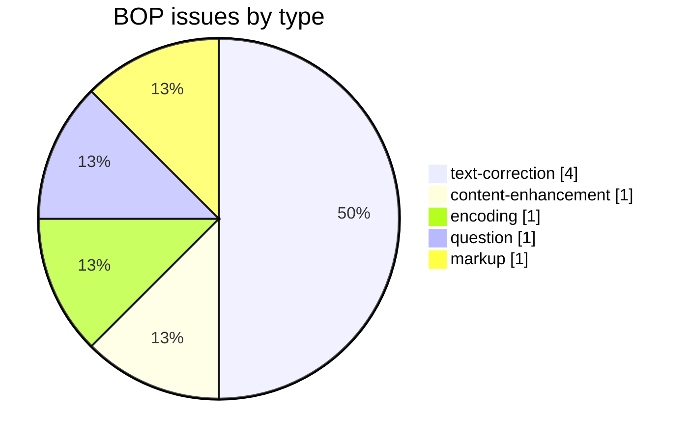
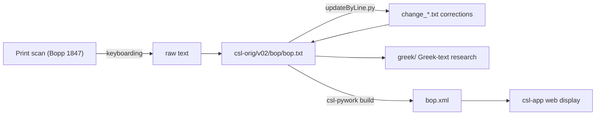

# BOP — Bopp *Glossarium Sanscritum*

_Created: 02-05-2022 · Last updated: 11-07-2026_

Development and correction repository for **Franz Bopp's *Glossarium Sanscritum* (1847)**, a Sanskrit→Latin dictionary, part of the [Cologne Digital Sanskrit Lexicon](https://www.sanskrit-lexicon.uni-koeln.de/) (CDSL). The canonical source text lives in [`csl-orig/v02/bop/bop.txt`](https://github.com/sanskrit-lexicon/csl-orig/blob/master/v02/bop/bop.txt) (8,961 entries); this repository holds correction and enrichment work (Greek-text research, per-issue corrections).

## Documentation

- [docs/CORRECTION_MANUAL.md](https://github.com/sanskrit-lexicon/BOP/blob/main/docs/CORRECTION_MANUAL.md) — **operator manual**: the correction pipeline applied to BOP, the Greek-text campaign as replayable provenance, the per-issue pattern, symptom→cause→cure.
- [CLAUDE.md](https://github.com/sanskrit-lexicon/BOP/blob/main/CLAUDE.md) — repository guide, correction workflow, and data-format reference.
- The canonical csl-orig correction workflow (snapshot → `updateByLine.py` → promote → build → validate → batch PR) is documented once in [csl-corrections/docs/correction-workflow.md](https://github.com/sanskrit-lexicon/csl-corrections/blob/main/docs/correction-workflow.md) — follow it rather than the abbreviated illustration below.

## Contents

| Path | Purpose |
|---|---|
| [greek/](https://github.com/sanskrit-lexicon/BOP/tree/main/greek) | Greek loanword / citation research in Bopp entries |
| [issues/](https://github.com/sanskrit-lexicon/BOP/tree/main/issues) | Per-issue correction workflows (`issueNNN/` pattern) |
| [prefaces/](https://github.com/sanskrit-lexicon/BOP/tree/main/prefaces) | Front-matter OCR (title page, preface, abbreviation list) + EN/RU translation — see [Front matter](#front-matter-prefaces) below |
| [CITATION.cff](https://github.com/sanskrit-lexicon/BOP/blob/main/CITATION.cff) | Machine-readable citation metadata |

## Usage example

A real entry from [`csl-orig/v02/bop/bop.txt`](https://github.com/sanskrit-lexicon/csl-orig/blob/master/v02/bop/bop.txt) — line 78, the "akaRwaka" entry:

```
78:{#akaRwaka#}¦ ( ex {#a#} priv. et {#kaRwaka#} hostis) liber ab
```

To correct the Latin gloss (e.g. `liber ab` → `liber a`, an ablative-preposition fix), write a paired-line change file and apply it with `updateByLine.py` — the full end-to-end procedure (BOM/`<LEND>`/CRLF gotchas, XML validation, batching) is in [csl-corrections/docs/correction-workflow.md](https://github.com/sanskrit-lexicon/csl-corrections/blob/main/docs/correction-workflow.md):

```
; issueNNN: fix Latin preposition in "akaRwaka" gloss
78 old {#akaRwaka#}¦ ( ex {#a#} priv. et {#kaRwaka#} hostis) liber ab
78 new {#akaRwaka#}¦ ( ex {#a#} priv. et {#kaRwaka#} hostis) liber a
```

```sh
python updateByLine.py bop.txt change_78.txt bop_corrected.txt
```

(Illustrative — no actual defect at this line; the workflow above is exact, only the fictitious Latin-preposition fix is invented to demonstrate the change-file mechanics.)

## Timeline

| Period | Activity |
|---|---|
| 2022-05 | Greek-text insertion begun |
| 2023-03 – 2023-04 | Corrections, AB-version reconciliation |
| 2024-01 – 2024-02 | Proofreading (Greek, Slavonic) |
| 2024-05 | Further corrections |
| 2026-05 | Issue taxonomy, citation metadata, documentation |
| 2026-06 | Front-matter OCR + EN/RU translation of the prefaces (`prefaces/`) |

## Projects & Milestones

| Milestone | Open | Closed | Total |
|---|---|---|---|
| Dictionary to Book | 0 | 0 | 0 |
| Digitization Quality | 1 | 4 | 5 |
| Structured Data | 0 | 2 | 2 |
| Major Enhancements | 0 | 1 | 1 |
| **Total** | **1** | **7** | **8** |



## Issues



### Open

| # | Title | Type | Severity | Milestone |
|---|---|---|---|---|
| 2 | deva-slp1 anomaly | encoding | minor | Digitization Quality |

### Solved

| # | Title | Type | Severity | Milestone |
|---|---|---|---|---|
| 1 | Greek text | content-enhancement | medium | Major Enhancements |
| 3 | Additional entry in AB version | text-correction | minor | Digitization Quality |
| 4 | Proofread Greek text | text-correction | medium | Digitization Quality |
| 5 | Proofread Slavonic text | text-correction | medium | Digitization Quality |
| 6 | Incorporate changes from BOP-Main-L2 file | text-correction | medium | Digitization Quality |
| 7 | Explanation of LS numbers in BOP | question | minor | Structured Data |
| 8 | [markup] Minor bop.txt Markup Oddities | markup | minor | Structured Data |

## Labels

### Type labels
| Label | Meaning |
|---|---|
| `link-target` | Click-throughs from `<ls>` abbreviations to scanned PDF pages |
| `link-splitting` | Splitting combined `SOURCE N,N` refs into per-page links |
| `markup` | Normalising XML tag content |
| `text-correction` | Corrections to Latin/Sanskrit definitions or headwords |
| `content-enhancement` | New material or structural additions beyond correction |
| `encoding` | SLP1/IAST transcoding, character normalisation |
| `scan-quality` | Replacing blurry/skewed/missing scan pages |
| `bug` | Broken links, XML errors, broken downloads |
| `question` | Scholarly questions requiring research |

### Severity labels
| Label | Meaning |
|---|---|
| `minor` | Targeted fix — a handful of lines or a single file |
| `medium` | Standard unit of work — one batch of corrections |
| `hard` | Large effort spanning many sources or files |

## Contributors

| Contributor | Commits |
|---|---|
| funderburkjim | 13 |
| drdhaval2785 | 9 |
| Mārcis Gasūns | 2 |
| AnnaRybakovaT | 2 |

## Source

- **Author**: Bopp, Franz
- **Title**: *Glossarium Sanscritum* (Glossarium comparativum linguae sanscritae)
- **Place / Publisher**: Berlin: Dümmler
- **Year**: 1847 (later expanded edition)
- **Language pair**: Sanskrit → Latin
- **Entries (digital edition)**: 8,961
- **License (digital edition)**: CC BY-SA 4.0
- See [CITATION.cff](https://github.com/sanskrit-lexicon/BOP/blob/main/CITATION.cff) for machine-readable citation.

## Encoding

- UTF-8 (NFC) throughout.
- Sanskrit text in SLP1 transliteration, wrapped in `{#…#}`; Latin gloss / italic display text in ``.
- Devanāgarī and IAST are generated at display time, not stored in the source.
- Greek-script citations stored as UTF-8 Greek.

## How it works



## Front matter (`prefaces/`)

The dictionary's **front matter** (title page, preface, abbreviation list) has been OCR'd from the Cologne csldoc scans into faithful Markdown and translated into English and Russian. See [prefaces/README.md](https://github.com/sanskrit-lexicon/BOP/blob/main/prefaces/README.md) for the full index.

- **Source language:** **Latin** (with Sanskrit in Devanāgarī + Roman transliteration, and comparative Greek, Old-Persian, Lithuanian, Slavic, Celtic forms).
- **Cologne source:** front-matter index → [boppref.html](https://sanskrit-lexicon.uni-koeln.de/scans/csldev/csldoc/build/dictionaries/prefaces/boppref.html) — 5 scans: title page, preface (2 pp.), abbreviation list (2 pp.).
- **Files:** `bopprefNN.md` (Latin source) + `.en.md` / `.ru.md` translations, one set per page. File-suffix conventions in [prefaces/README.md](https://github.com/sanskrit-lexicon/BOP/blob/main/prefaces/README.md).
- **Consolidated editions:** [boppref_all.la.md](https://github.com/sanskrit-lexicon/BOP/blob/main/prefaces/boppref_all.la.md) · [boppref_all.en.md](https://github.com/sanskrit-lexicon/BOP/blob/main/prefaces/boppref_all.en.md) · [boppref_all.ru.md](https://github.com/sanskrit-lexicon/BOP/blob/main/prefaces/boppref_all.ru.md) — built reproducibly by [build_combined.py](https://github.com/sanskrit-lexicon/BOP/blob/main/prefaces/build_combined.py).
- **Signatures / dates:** no author signature or date in the front matter beyond the title-page imprint year **MDCCCXLVII (1847)**, Berlin, Dümmler. The preface (pp. V–VI) is unsigned.
- The digitizer running-header/footer stamps and the library accession stamp (`M-1126`) were omitted as not part of the original.

> **OCR run notes (2026-06-22)** — cost, timing, and technical lessons
>
> Produced by the `/cologne-preface-ocr` skill (vision OCR + translation). Process retrospective, not part of the deliverable. This was a **resume** run: pages 01–03 (title + preface) had been OCR'd and translated in a prior session that stalled; this run completed the missing abbreviation pages 04–05 and the consolidation/README scaffolding.
>
> **Cost.** Synchronous, single-thread (no subagents per retry rules). This resume run: ≈80–100k tokens, dominated by ~9 native-resolution crop reads (abbr1/abbr2 in 3 bands each + 2 layout overviews) plus the 4 translation writes and README/build work. Prior session (pages 01–03 OCR + 6 translations) not re-counted here.
>
> **Time.** Resume wall-clock ≈8 min, gated by sequential crop→read of the two abbreviation pages.
>
> **Technical lessons (reusable):**
> 1. The two abbreviation scans were single-column (3328×4677); the *SIGLORUM EXPLICATIO* fit in 3 native-res bands per page scaled to 1900 px wide — clean Latin, no `[?]` needed.
> 2. Sigla keys and bibliographic work-titles (Bhagavad-Gîta, Râmâyana, Rigveda, *Radices Sanscritae*, etc.) are kept verbatim in all three languages; only the connective Latin (`X. est …`) and the footnote prose are translated.
> 3. Scans were already present from the stalled run — no re-download needed; reused `scans/*.jpg` directly (csldoc serves these as `.jpg`, not `.png`).
> 4. The accession stamp `M-1126` / *Universität zu Köln, Seminar für Indologie* at the foot of the last scan is a library mark, not original — omitted.

---
*Issue taxonomy and documentation per the [Cologne issue runbook](https://github.com/sanskrit-lexicon/csl-observatory/blob/main/runbook/cologne-issue-runbook.md).*

_Dr. Mārcis Gasūns_
