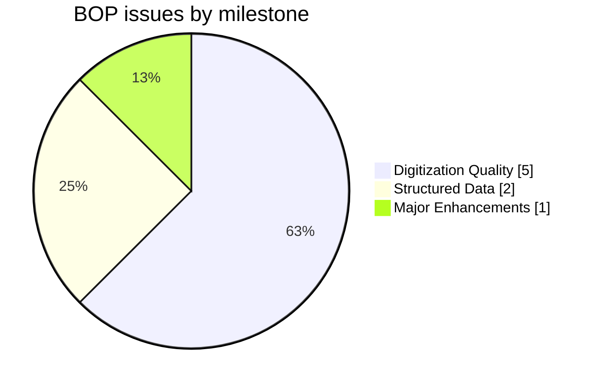
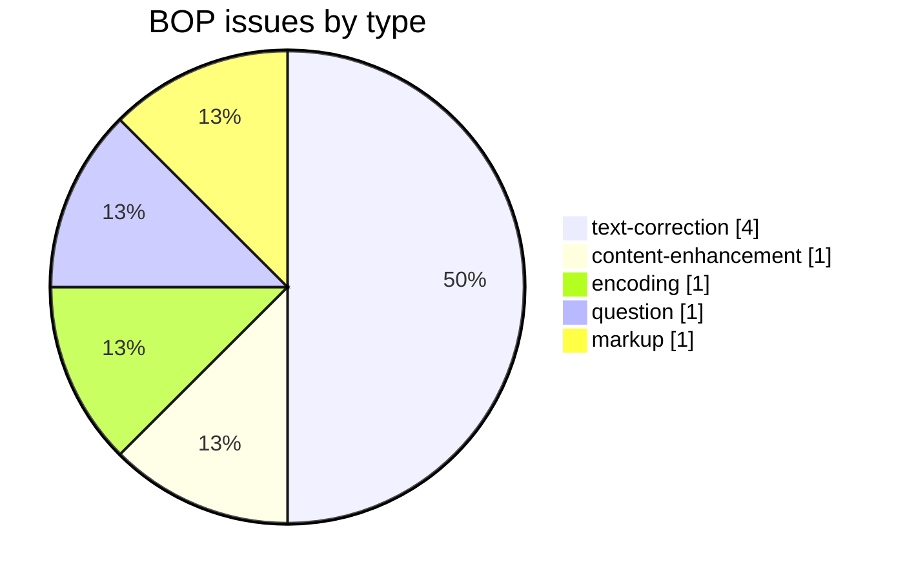
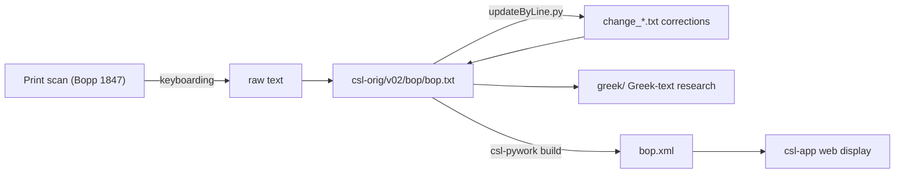

# BOP — Bopp *Glossarium Sanscritum*

Development and correction repository for **Franz Bopp's *Glossarium Sanscritum* (1847)**, a Sanskrit→Latin dictionary, part of the [Cologne Digital Sanskrit Lexicon](https://www.sanskrit-lexicon.uni-koeln.de/) (CDSL). The canonical source text lives in [`csl-orig/v02/bop/bop.txt`](https://github.com/sanskrit-lexicon/csl-orig/blob/master/v02/bop/bop.txt) (8,961 entries); this repository holds correction and enrichment work (Greek-text research, per-issue corrections).

## Documentation

- [CLAUDE.md](CLAUDE.md) — repository guide, correction workflow, and data-format reference.

## Contents

| Path | Purpose |
|---|---|
| `greek/` | Greek loanword / citation research in Bopp entries |
| `issues/` | Per-issue correction workflows (`issueNNN/` pattern) |
| `CITATION.cff` | Machine-readable citation metadata |

## Timeline

| Period | Activity |
|---|---|
| 2022-05 | Greek-text insertion begun |
| 2023-03 – 2023-04 | Corrections, AB-version reconciliation |
| 2024-01 – 2024-02 | Proofreading (Greek, Slavonic) |
| 2024-05 | Further corrections |
| 2026-05 | Issue taxonomy, citation metadata, documentation |

## Projects & Milestones

| Milestone | Open | Closed | Total |
|---|---|---|---|
| Dictionary to Book | 0 | 0 | 0 |
| Digitization Quality | 1 | 4 | 5 |
| Structured Data | 0 | 2 | 2 |
| Major Enhancements | 0 | 1 | 1 |
| **Total** | **1** | **7** | **8** |

## Issues

### Open

| # | Title | Type | Severity | Milestone |
|---|---|---|---|---|
| 2 | deva-slp1 anomaly | encoding | minor | Digitization Quality |

### Solved

| # | Title | Type | Severity | Milestone |
|---|---|---|---|---|
| 1 | Greek text | content-enhancement | medium | Major Enhancements |
| 3 | Additional entry in AB version | text-correction | minor | Digitization Quality |
| 4 | Proofread Greek text | text-correction | medium | Digitization Quality |
| 5 | Proofread Slavonic text | text-correction | medium | Digitization Quality |
| 6 | Incorporate changes from BOP-Main-L2 file | text-correction | medium | Digitization Quality |
| 7 | Explanation of LS numbers in BOP | question | minor | Structured Data |
| 8 | [markup] Minor bop.txt Markup Oddities | markup | minor | Structured Data |

## Labels

### Type labels
| Label | Meaning |
|---|---|
| `link-target` | Click-throughs from `<ls>` abbreviations to scanned PDF pages |
| `link-splitting` | Splitting combined `SOURCE N,N` refs into per-page links |
| `markup` | Normalising XML tag content |
| `text-correction` | Corrections to Latin/Sanskrit definitions or headwords |
| `content-enhancement` | New material or structural additions beyond correction |
| `encoding` | SLP1/IAST transcoding, character normalisation |
| `scan-quality` | Replacing blurry/skewed/missing scan pages |
| `bug` | Broken links, XML errors, broken downloads |
| `question` | Scholarly questions requiring research |

### Severity labels
| Label | Meaning |
|---|---|
| `minor` | Targeted fix — a handful of lines or a single file |
| `medium` | Standard unit of work — one batch of corrections |
| `hard` | Large effort spanning many sources or files |

## Contributors

| Contributor | Commits |
|---|---|
| funderburkjim | 13 |
| drdhaval2785 | 9 |
| Mārcis Gasūns | 2 |
| AnnaRybakovaT | 2 |

## Source

- **Author**: Bopp, Franz
- **Title**: *Glossarium Sanscritum* (Glossarium comparativum linguae sanscritae)
- **Place / Publisher**: Berlin: Dümmler
- **Year**: 1847 (later expanded edition)
- **Language pair**: Sanskrit → Latin
- **Entries (digital edition)**: 8,961
- **License (digital edition)**: CC BY-SA 4.0
- See [CITATION.cff](CITATION.cff) for machine-readable citation.

## Encoding

- UTF-8 (NFC) throughout.
- Sanskrit text in SLP1 transliteration, wrapped in `{#…#}`; Latin gloss / italic display text in ``.
- Devanāgarī and IAST are generated at display time, not stored in the source.
- Greek-script citations stored as UTF-8 Greek.

## How it works

---
*Issue taxonomy and documentation per the [Cologne issue runbook](https://github.com/sanskrit-lexicon/csl-observatory/blob/main/runbook/cologne-issue-runbook.md).*
